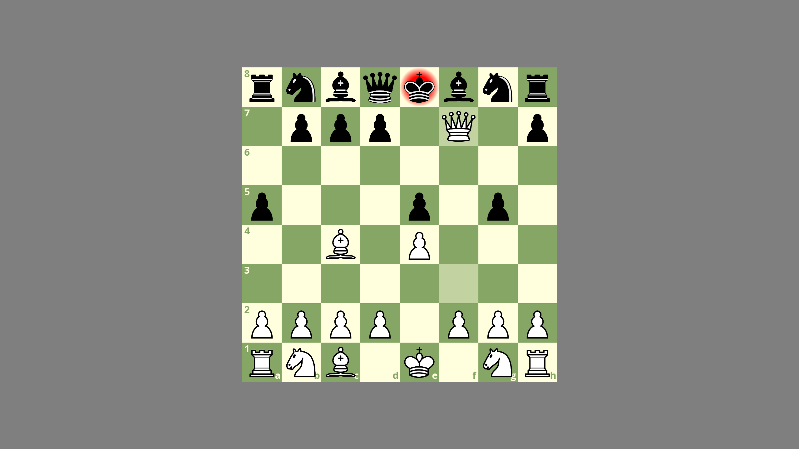
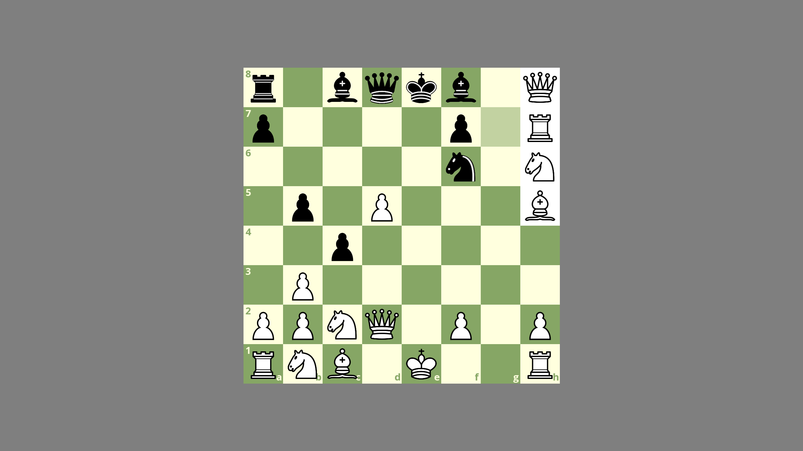
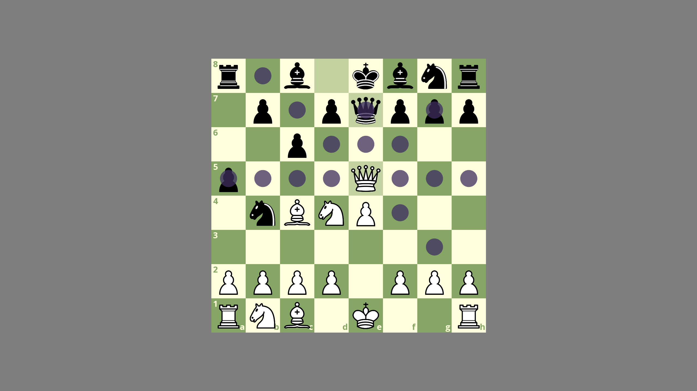
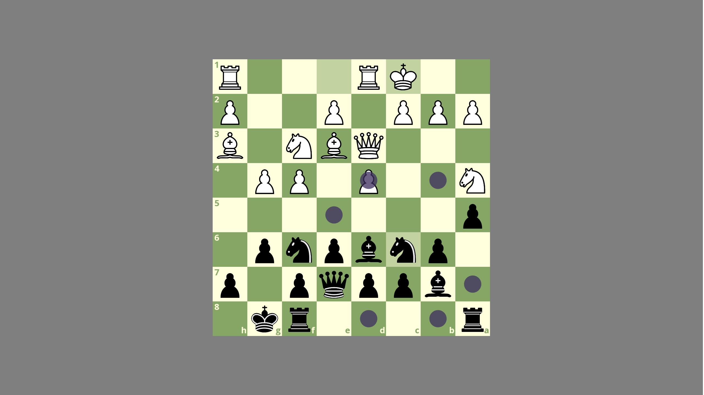

# ♟️ Chess Game (SFML 3.0.0, C++)

## Description
This is a functional chess game implemented in C++ using SFML 3.0.0.  
It supports all standard rules of chess.  
This is a **hobby project**, created for learning purposes and personal development.

### Implemented Features
- ✅ **Full chess rules:**
  - Legal movement for all pieces
  - En passant
  - Castling
  - Pawn promotion
  - Check, checkmate, stalemate
  - Draw detection:
    - Triple repetition of the position
    - 50-move rule (no pawn move or capture)
    - Insufficient material
- 🎯 **Piece interaction:**
  - Click or drag pieces to move them
  - Highlighting of selected pieces
  - Optional highlighting of all legal moves for selected piece
- ♟️ **Game interface:**
  - Reset the game at any time
  - Rotate the board (flip view)
- 📝 **PGN Export:**
  - Possibility to save the game in PGN format

  ## Future Plans

- 📂 **PGN Game Loading:**
  - Allow loading a saved game from a PGN file to review previous games.
- 🎯 **Piece interaction:**
   - Implement an animation to smoothly move a chess piece


## Screenshots





## Video Demonstrating the Application
[Video demonstrating the application on youtube](https://youtu.be/IbKoTMAY4-0)

## Requirements
To build and run the project, you need:
- **C++ Compiler** (compatible with SFML 3.0.0)
- **SFML 3.0.0** (installed and linked properly)
- **Graphics Card** supporting **OpenGL 2.1** or higher

## Installation & Setup
1. Download and install **SFML 3.0.0** from [SFML official site](https://www.sfml-dev.org/) or [github SFML](https://github.com/SFML/SFML).
2. Clone this repository:
   ```sh
   git clone https://github.com/MarcinTechX/Chess
   cd <repo-folder>
   ```
3. Compile and run using your preferred method.

### Using g++
```sh
g++ chess.cpp board.cpp piece.cpp pawn.cpp bishop.cpp king.cpp rook.cpp knight.cpp queen.cpp soundmanager.cpp colorconverter.cpp parser.cpp -o <output_file_name> -I"<SFML_path>/include" -L"<SFML_path>/lib" -lsfml-graphics -lsfml-window -lsfml-system -lsfml-audio
```

## Controls
- **LMB:** Select and move pieces (click or drag)
- **F:** Flip board
- **R:** Reset game (not reset highlighting)
- **H:** Highlight squares
- **S:** Save current game as PGN (create a new subfolder and a .txt file with PGN notation in this subfolder)
- **ESC:** Exit game

## License
This project is released under the MIT License.
